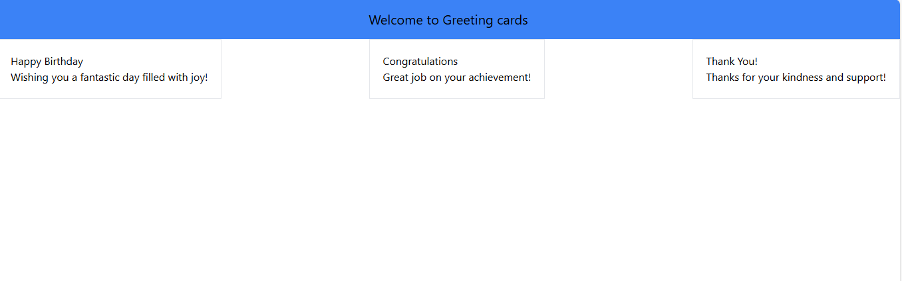

# Greetings Card Project

### Project Overview

This project is a React app that shows three greeting cards with different messages. The goal was to build a simple app where users can see different greetings, and the app quickly updates changes you make. It was built using Vite, which helps the app run fast and shows updates instantly.
                While working on this, I learned how to use React to create components (small pieces of code) and how to make the app update quickly using Vite. I also learned how to organize the app, keep things neat, and manage the information that shows up on each greeting card.


### Features:
- Displays three greeting cards with different messages.
- Built using React and Vite for quick development.
- Includes ESLint for maintaining clean and error-free code.

### Setup

1. Clone the project:
   ```bash
   git clone <repository_url>
   cd <project_directory>
   ```

2. Install dependencies:
   ```bash
   npm install
   ```

3. Run the app:
   ```bash
   npm run dev
   ```
   - This starts the app and opens it in your browser. Any changes you make will show up instantly!

### Available Commands

- `npm run dev`: Start the app locally with live updates.
- `npm run build`: Prepare the app for production.
- `npm run preview`: Check the production build locally.

### Project Structure

```
/src
  /components  # Contains greeting card components
  App.jsx     # Main app code displaying greeting cards
  index.js    # React entry point
/public
  index.html   # HTML template
```

### Notes

- The app displays three greeting cards with different messages.
- Use React for building the UI and Vite for fast development.
- HMR ensures changes show up instantly in the browser.


### Testing Screenshots

Here’s a screenshot of the final app with the Header and three greeting cards displayed:



--- 


### Discussion

This project was a good way to practice using React and Vite. I got to create different greeting cards that can be reused, and learned how to make the app update fast whenever I made changes. There were a few challenges around how to make sure everything looked right, but it was a great experience.

